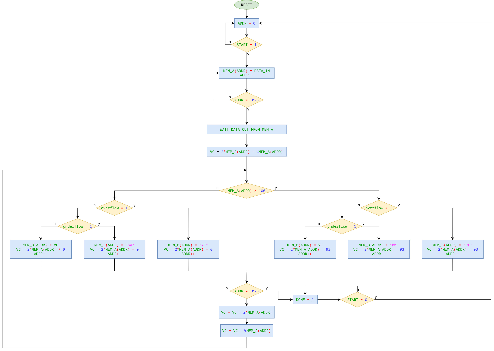

# Laboratorio 6 - implementazione di un filtro FIR

Gianfranco Antonioli  
Lorenzo Leli  
Alessandro Ribaudo

## Indice

- [Laboratorio 6 - implementazione di un filtro FIR](#laboratorio-6---implementazione-di-un-filtro-fir)
	- [Indice](#indice)
	- [Overview del progetto](#overview-del-progetto)
		- [Pseudocodice](#pseudocodice)
		- [Data Path](#data-path)
		- [ASM Chart](#asm-chart)
		- [Control ASM](#control-asm)
		- [State Diagram](#state-diagram)
	- [Simulazione](#simulazione)
		- [Uso dei file per il testbench](#uso-dei-file-per-il-testbench)
		- [Uso di python per generazione e verifica dati](#uso-di-python-per-generazione-e-verifica-dati)
		- [Waveform](#waveform)
	- [Timing analysis](#timing-analysis)
		- [Determinazione della frequenza massima](#determinazione-della-frequenza-massima)
	- [Tempo di calcolo del sistema](#tempo-di-calcolo-del-sistema)
	- [Appendice A - Considerazioni sulla scelta del parallelismo e approssimazione](#appendice-a---considerazioni-sulla-scelta-del-parallelismo-e-approssimazione)
	- [Appendice B - Listati Completi VHDL](#appendice-b---listati-completi-vhdl)
		- [file `mux2to1.vhd`:](#file-mux2to1vhd)
		- [file `mux4to1.vhd`:](#file-mux4to1vhd)
		- [file `countern.vhd`:](#file-counternvhd)
		- [file `adder.vhd`:](#file-addervhd)
		- [file `architectural_adders.vhd`:](#file-architectural_addersvhd)
		- [file `memory.vhd`:](#file-memoryvhd)
		- [file `reg_11b.vhd`:](#file-reg_11bvhd)
		- [file `bit8to11.vhd`:](#file-bit8to11vhd)
		- [file `bit11to8.vhd`:](#file-bit11to8vhd)
		- [file `divideByMinus4.vhd`:](#file-dividebyminus4vhd)
		- [file `multiplyBy2.vhd`:](#file-multiplyby2vhd)
		- [file `of_uf_fgen.vhd`:](#file-of_uf_fgenvhd)
		- [file `tipwarning_detector.vhd`:](#file-tipwarning_detectorvhd)
		- [file `datapath.vhd`:](#file-datapathvhd)
		- [file `ControlUnit.vhd`:](#file-controlunitvhd)
		- [file `tb_lab6.vhd`:](#file-tb_lab6vhd)
	- [Appendice C - Altri script utilizzati](#appendice-c---altri-script-utilizzati)
		- [file `tb.py`:](#file-tbpy)
- [TODO checklist](#todo-checklist)

## Overview del progetto

L'algoritmo $VC[i] = 1.75E[i] + 2E[i - 1] - VCS[i-1]$ al quale più avanti ci riferiremo con $F()$ è stato implementato facendo uso di un solo adder e degli shift del numero in binario in modo da ottenere il numero moltiplicato per esponenti di 2.
In particolare si fa notare che il coefficiente 1.75 è considerabile come la somma di esponenti di 2 nei seguenti modi:

- $1.75 = 1 + \tfrac{1}{2} + \tfrac{1}{4}$
- $1.75 = 2 - \tfrac{1}{4}$

Si è scelta la seconda rappresentazione, in quanto composta da una sola somma invece di due, rendendo pertanto l'algoritmo più veloce; inoltre lo shift left per ottenere il cofficiente 2 è già presente nel circuito per calcolare il contributo $2E[i − 1]$.

### Pseudocodice

```matlab
loop forever:
	while (start != 1)
		ADDR=0
	end while

	# start received

	while (ADDR != 1023)
		MEM_A(ADDR) = DATA_IN
		ADDR++
	end while

	# mem_a loaded, let's now begin the algorithm 

	VC = 2*MEM_A(ADDR) - ¼MEM_A(ADDR)

	while (ADDR != 1023)
		if (MEM_A(ADDR) > 100)
			if(overflow)
				MEM_B(ADDR) = "0x7F"
				VC = 2*MEM_A(ADDR) - 93
				ADDR++
			else if(underflow)
				MEM_B(ADDR) = "0x80"
				VC = 2*MEM_A(ADDR) - 93
				ADDR++
			else
				MEM_B(ADDR) = VC
				VC = 2*MEM_A(ADDR) - 93
				ADDR++
			end if
	else
				if(overflow)
				MEM_B(ADDR) = "0x7F"
				VC = 2*MEM_A(ADDR) + 0
				ADDR++
			else if(underflow)
				MEM_B(ADDR) = "0x80"
				VC = 2*MEM_A(ADDR) + 0
				ADDR++
			else
				MEM_B(ADDR) = VC
				VC = 2*MEM_A(ADDR) + 0
				ADDR++
			end if
		end if
		VC = VC + 2*MEM_A(ADDR)
		VC = VC - ¼MEM_A(ADDR)
	end while
	DONE = 1
end loop
```

### Data Path

Riassumiamo ora il funzionamento dei componenti del datapath:

1. **addr_count**: è un contatore controllato dalla CU tramite segnali di *enable* e *restart*. La sua uscita rappresenta l'indirizzo delle memorie A e B al quale si intende lavorare.  

1. **terminalCount**: analizza l'uscita del contatore, generando un flag al raggiungimento dell'ultimo indirizzo che l'algoritmo deve analizzare (nel nostro caso specifico, *1023*).  

1. **mem_A**: è la memoria nella quale vengono scritti i dati letti dal segnale esterno *DATA_IN*, e successivamente quando richiesto dalla CU il dato specificato dal contatore viene portato in uscita *D_OUT*. 

1. **8to11bit**: in seguito alle [considerazioni descritte in appendice](#appendice-a---considerazioni-sulla-scelta-del-parallelismo-e-approssimazione), questo componente deve convertire il numero intero su 8 bit in ingresso in un numero di virgola fissa su 11 bit, con il LSB come posizione di peso $2^{-1}$.

1. **tipwarning_detector**: prendendo in ingresso il dato letto dalla memoria, genera il flag di *tipwarning* se la control unit lo abilita.

1. **divideByMinus4**: per realizzare la divisione per 4, questo componente compie uno shift verso destra di 2 posizioni, e successivamente nega il risultato; al momento di sommarlo, la CU inserirà nel sommatore un carry pari a 1, in modo da calcolare correttamente il complemento a 2 e fare la sottrazione.

1. **multiplyBy2**: in modo simile alla divisione per 4, questo componente compie uno shift verso sinistra di 1 posizione per ottenere il prodotto per 2 del dato in ingresso.

1. **reg_A**: questo registro è stato utilizzato da accumulatore per salvare il risultato parziale di ogni operazione di somma. Al termine del ciclo di operazioni per ogni bit, al suo interno sarà memorizzato il valore finale del risultato su 11 bit.

1. **mux1**: questo multiplexer a 4 ingressi, controllato dal segnale di selezione generato dalla CU, seleziona il dato corretto da portare in ingresso al sommatore.

1. **mux2**: come `mux1`, questo multiplexer a 2 ingressi seleziona il dato corretto da portare all'ingresso del sommatore.

1. **Add**: il sommatore è il cuore del datapath. Effettua la somma dei dati selezionati dai multiplexers, eventualmente con un carry in ingresso se richiesto dalla CU. Il risultato viene poi portato in ingresso a `reg_A`, in modo da memorizzarlo per l'operazione successiva.

1. **11to8bit**: converte il risultato da 11 bit a 8 bit. 

1. **OF_UF_Fgen**: non è sempre possibile convertire il risultato da 11 a 8 bit correttamente. Questo componente genera quindi un flag di overflow o di underflow in caso il risultato sia troppo grande per essere rappresentato su 8 bit.

1. **mux3**: questo multiplexer seleziona in base al segnale generato dalla CU il dato corretto da portare in ingresso sulla memoria B. Si noti che solo 3 porte sono necessarie ai fini dell'algoritmo, ma il multiplexer è dotato di 4 porte; una porta è pertanto collegata a 0, in modo da non lasciare ingressi aperti. La CU si occuperà di non selezionare mai questo ingresso.

1. **mem_B**: è la memoria sulla quale vengono scritti i risultati finali dell'algoritmo, ciascuno nella rispettiva cella di memoria, selezionata dal contatore.


### ASM Chart
1. **reset_state**: il contatore degli indirizzi viene tenuto al conteggio zero in attesa del segnale di start, tutto il resto del data path è in stato di idle, il `reg_A` non viene resettato in quanto non è necessario.
1. **Load**: per ogni periodo di clock il contatore degli indirizzi viene incrementato e la `mem_B` è configurata per scrivere i dati provenienti dalla sorgente esterna fino al raggiungimento del terminal count.
1. **CalcFirst**: l'indirizzo del contatore sta puntando alla locazione di memoria *0x00* e il data path viene configurato per svolgere la prima operazione sul dato: $-0.25E[0]+2E[0]$.
1. **start_TW_output**: a questo punto il dato $E[0]$ si sarà presentato sull'uscita della memoria, quindi si abilita l'output del segnale di tipwarning *(che fino ad ora non era determinabile)* e si carica il risultato della somma nel `reg_A`, si ablita un conteggio del contatore degli indirizzi e in base al valore delle flags di overflow, underflow e tipwarning si passa ad uno dei 6 stati successivi *SUM_XE_YY*.
1. **SUM_NE_OK, SUM_NE_UF, SUM_NE_OF, SUM_E_OK, SUM_E_UF, SUM_E_OF**: questi stati differiscono solo per il pilotaggio dei segnali di controllo dei multiplexer `mux1` e `mux3`. In questi stati si fa il salvataggio del dato calcolato negli stati precedenti ora contenuto nel `reg_A` nella `mem_B` la parte teminale del nome dello stato *(_YY)* indica il segnale di controllo su `mux3`:  

    - _OK: dato ok, il multiplexer seleziona la linea *0b00* e il dato riportato su 8 bit viene salvato
    - _UF: underflow, il multiplexer seleziona la linea *0b10* e la costante *0x80* viene salvata in memoria
    - _OF: overflow, il multiplexer seleziona la linea *0b01* e la costante *0x7F* viene salvata in memoria

    Così facendo si ottiene il risultato parziale $2E[i - 1] - VCS[i-1]$ e lo si carica nel registro `reg_A`. Se la flag che indica l'azzeramento del contatore degli indirizzi è attiva si è terminato l'algoritmo e si passa allo stato done_state altrimenti si prosegue.

    - _E: Error, il dato necessita della correzione con la costante, il multiplexer seleziona la linea *0b10*
    - _NE: Not Error, il dato non necessita della correzione con la costante, il multiplexer seleziona la linea *0b11*

    Così facendo si ottiene il risultato parziale $2E[i - 1] - VCS[i-1]$ e lo si carica nel registro `reg_A`.
Se la flag che indica l'azzeramento del contatore degli indirizzi è attiva si è terminato l'algoritmo e si passa allo stato *done_state*, altrimenti si prosegue.

1. **Sum_2E**: in questo stato il dato in uscita dalla memoria si sarà aggiornato, i multiplexer vengono configurati per sommare al risultato parziale in uscita da `reg_A` il contibuto $2E[i]$, `mux1` seleziona la linea *0b00* e `mux2` seleziona la linea *0b0*, il nuovo risultato $2E[i]+2E[i - 1] - VCS[i-1]$ viene caricato in `reg_A`.
1. **sub_1quarterE**: si procede analogamente allo stato precedente sottraendo il contributo $-0.25E[i]$ selezionando con il `mux1` la linea *0b01*, fornendo un carry in ingresso al sommatore per poter eseguire correttamente il complemento a 2 e incrementando il contatore degli indirizzi; a questo punto in base allo stato delle flags si passa ad uno degli stati *SUM_XE_YY*.
1. **done_state**: in questo stato si segnala la fine dell'algoritmo mediante il segnale di *DONE* e si attende il rilascio del segnale di *START* per completare l'handshake.



### Control ASM 


### State Diagram
Dal diagramma a stati di Quartus si è verificata la corrispondenza con l'ASM chart e la corretta sintesi di quanto descritto nella control unit.


## Simulazione

### Uso dei file per il testbench

Per simulare il corretto funzionamento dell'algoritmo è stato scritto un file di testbench che carica i dati nel sistema dalla porta *DATA_IN* prelevandoli da un file testuale *(si veda file [tb_lab6.vhd](#file-tb_lab6.vhd))*; inoltre i file delle memorie sono stati modificati per scrivere su file ciò che viene salvato *(si veda file [memory.vhd](#file-memory.vhd))*. Si possono quindi verificare le **seguenti relazioni:**

- `bit_simulation_memA.txt` = `bit_input.txt`
- `bit_simulation_memA.txt` = F(`bit_simulation_memA.txt`)

dove F è la funzione implementata dal sistema.

### Uso di python per generazione e verifica dati

Il file di input è stato generato in modo casuale tramite uno script python *(si veda file [tb.py](#file-tb.py))*, che ha poi confrontato i risultati della simulazione con i risultati teorici, calcolando l'errore generato dal sistema.

```
 in int         in bit  out real  sim int    out sim bit   error
    -28       11100100     -49.0      -49       11001111     0.0
   -119       10001001    -128.0     -128       10000000     0.0
    -33       11011111    -128.0     -128       10000000     0.0
   -116       10001100    -128.0     -128       10000000     0.0
     45       00101101    -128.0     -128       10000000     0.0
   -114       10001110    -109.5     -110       10010010     0.5
     -6       11111010    -128.0     -128       10000000     0.0
    -55       11001001   -108.25     -108       10010100   -0.25
    -97       10011111    -128.0     -128       10000000     0.0
     46       00101110    -113.5     -114       10001110     0.5
    -97       10011111    -77.75      -78       10110010    0.25
    -47       11010001    -128.0     -128       10000000     0.0
    107       01101011     93.25       93       01011101    0.25
    -56       11001000      23.0       23       00010111     0.0
   -126       10000010    -128.0     -128       10000000     0.0
    -73       10110111    -128.0     -128       10000000     0.0
     94       01011110      18.5       18       00010010     0.5
     23       00010111     127.0      127       01111111     0.0
     81       01010001     127.0      127       01111111     0.0
```

Questo estratto del file prodotto dallo script python mostra i risultati teorici, i risultati calcolati dal sistema, e l'errore compiuto. Si può osservare che l'errore massimo vale $0.5$, inevitabile a causa della limitazione a 8 bit. Una trattazione più approfondità sull'argomento è svolta [in appendice](#appendice-a---considerazioni-sulla-scelta-del-parallelismo-e-approssimazione).

### Waveform

Nella waveform estratta dalla simulazione *ModelSim* sono stati evidenziati i vari cicli di funzionamento del circuito:
Nell'ultimo stato del ciclo precedente (*sub_1quarterE*), il sistema determina già se per il prossimo dato sarà necessario sommare la costante $VCS=0$ oppure $VCS=-93$; dovrà inoltre determinare se il dato attuale subirà overflow o underflow nella conversione da 11 a 8 bit. Nel caso presentato nell'immagine seguente, essendo il flag di UnderFlow alto ed essendo il dato <100 $[(11100110000)_2 = (-208)_{10}]$.  
Al successivo colpo di clock si può quindi osservare che il sistema entra correttamente nello stato *SUM_NE_UF*. In questo stato, il mux3 deve selezionare il dato "0x80", e poi portare nel sommatore la costante $0$ e il valore $2E$. Possiamo osservare che le uscite dei multiplexer sono quindi corrette.  
I due stati successivi sono necessariamente *SUM_2E* e *sub_1quarter*, a prescindere dagli ingressi. È possibile verificare la correttezza dall'immagine. In questi stati l'uscita del mux3 non è importante, in quanto la memoria B non sta memorizzando i dati che le vengono presentati in ingresso. I multiplexer *mux1* e *mux2* invece selezionano correttamente gli ingressi del sommatore.  
Al termine dello stato *sub_1quarter*, come per il ciclo precedente, si determina l'eventuale presenza di overflow o underflow e la costante $VCS$ necessaria al dato successivo. Lo stato successivo è quindi correttamente *SUM_NE_OK*.


## Timing analysis

### Determinazione della frequenza massima

Dalla timing analysis si evince che il percorso più lungo è dalla porta di uscita della memoria A, fino alla macchina a stati passando per il sommatore e la generazione delle flags di over/under flow. Il componente più complesso e che porta più ritardo sul signal path è il sommatore. Per cercare la soluzione ottimale sono stati sviluppati 3 adder e sono stati messi a confronto i risultati della timing analysis, i cui risultati sono riportati qui sotto:

| Adder testato					| Periodo minimo	| frequenza massima	| Costo HW	|
| -----------------------------	| --------------:	| -----------------	| --------	|
| Ripple carry adder			| 5.427				| 184.26			| medio		|
| Carry select pesato ricorsivo	| 5.523				| 181.06			| alto		|
| Behavioral					| 5.182				| 192.97			| minimo	|

L'implementazione scelta è quella del Behavioral, che in technology view risulta sviluppato simile ad un Ripple Carry Adder formato da blocchi 4-LUT.


## Tempo di calcolo del sistema

Possiamo suddividere l'algoritmo in diverse fasi e ricavare il numero di cicli di clock utilizzati:

| nome						| periodi di clock	| cicli	| periodi di clock totali	|
| -----------------------	| ----------------	| -----	| ------------------------	|
| caricamento dati			| 1					| 1024	| 1024						|
| calcolo del primo dato	| 2					| 1		| 2							|
| calcolo dati successivi	| 3					| 1023	| 3069						|
| passaggio a done/reset	| 2					| 1		| 2							|

ottenendo un totale di **4097** cicli di clock (dallo *START* al *DONE*). Se si usasse come sorgente di clock un oscillatore al quarzo di frequenza 190 MHz, che è comunemente [disponibile sul mercato](https://www.mouser.it/c/passive-components/frequency-control-timing-devices/oscillators/?frequency=190%20MHz), si puo calcolare il tempo totale dell'algoritmo come $\frac{4097}{190\,\text{MHz}} = 21.56\,\mu s$.


## Appendice A - Considerazioni sulla scelta del parallelismo e approssimazione

Per risolvere l'algoritmo in modo corretto senza incorrere in overflow o underflow è necessario individuare il numero minimo di bit necessari. Andando a calcolare il worst case sia per i numeri positivi che per i numeri negativi, ci siamo accorti che i contributi maggiori presenti nell'algoritmo sono dovuti al valore attuale $E[i]$ ed al valore precedente $E[i-1]$ che sono entrambi moltiplicati per 2. La divisione per $\frac{1}{4}E[i]$ e il parametro di correzione $VCS[i-1]$ non danno contributo significativo, anzi aiutando ad allontanarci dalla condizione di overflow; verranno pertanto ignorati nel calcolo dei bit utili. I dati in arrivo dalla memoria sono su 8 bit, ma dal momento che devono essere raddoppiati, è necessario aggiungere un ulteriore bit. Infine, si effettua la somma di $2E[i] + 2E[i-1]$ che è composta da due addendi composti da 9 bit. Il risultato deve essere quindi su almeno 10 bit. Se usassimo però il minimo numero di bit richiesto per risolvere l'algoritmo, commetteremmo un errore massimo di $0.75$ in quanto troncheremmo il numero decimale ottenuto dall'operazione $\frac{1}{4}E[i]$ all'intero inferiore. Abbiamo dunque scelto di utilizzare 11 bit (10 bit per la parte intera del numero e 1 bit per la parte dopo la virgola) in modo da ottenere un errore massimo di $0.5$. Si può osservare come l'unica operazione dell'algoritmo che porta contributi non interi sia la divisione per 4. Per eseguire l'operazione in modo corretto, infatti, sono necessari 2 bit decimali (con numeri in base 10 la parte decimale può essere solo pari a 00, 25, 50, 75 che in numeri binari diventa: 00, 01, 10, 11). Abbiamo in primo luogo eliminato il LSB riducendo i numeri dopo la virgola da 2 bit a 1 bit in quanto il bit più a destra comporta un contributo di 0.25 in modulo 10 che non è sensibile rispetto alla minima variazione che può avere il risultato dell'algoritmo. In questo modo abbiamo approssimato il risultato al numero inferiore avente 1 solo bit dopo la virgola. Svolgendo quindi tutte le operazioni su 11 bit (10 per la parte intera e 1 per la parte dopo la virgola) è possibile ottenere il risultato con un errore massimo di $0.5$. Per capire come questo sia possibile, è utile vedere il disegno sottostante in cui è stata riportata una rappresentazione grafica dei numeri in complemento a 2 (per semplicità consideriamo un numero composto da 4 bit, 3 per la parte intera e 1 per la parte dopo la virgola, e poi estendiamo il ragionamento per un numero composto da un numero qualsiasi di bit interi). Per come è costruito il disegno, si vede che ruotando in senso orario si passa ad un numero binario più grande e viceversa. Le frecce blu indicano lo spostamento sul grafico dovuto all'eliminazione del secondo bit dopo la virgola. Nel nostro algoritmo dobbiamo sottrare da un intero il numero floating point ottenuto dalla divisione per 4. Per eseguire questa operazione in binario è necessario fare il complemento a 2 del sottraendo e poi sommare il risultato ottenuto con il minuendo. Sul grafico sottostante, fare il complemento a 2 significa spostarsi orizzontalmente fino ad incrociare un nuovo punto della circonferenza (frecce verdi). Una volta finito l'algoritmo, i dati passano dal blocco `bit11to8` che tronca il numero floating point trasformandolo in un intero. L'operazione di troncatura fa diminuire il numero fino ad arrivare al primo intero inferiore che sul grafico significa ruotare in verso antiorario (frecce arancioni). Questo meccanismo ci permette di ottenere un risultato con un'approssimazione massima di $0.5$ invece che di $0.75$ che si avrebbe con una semplice troncatura.  
Andiamo a fare alcuni esempi considerando un numero su 4 bit (3 per la parte intera a 1 per la parte dopo la virgola):
La tabella sottostante mostra alcuni esempi su 4 bit (3 per la parte intera a 1 per la parte dopo la virgola):


## Appendice B - Listati Completi VHDL

### file `mux2to1.vhd`:

```vhdl
library ieee;
use ieee.std_logic_1164.all;
use ieee.numeric_std.all;

entity mux2to1 is
	generic(
		i_sup : integer := 8;
		i_low : integer := 0
	);
	port(	
		x : in signed(i_sup downto i_low);
		y : in signed(i_sup downto i_low);
		s : in std_logic;
		m : out signed(i_sup downto i_low)
	);
end entity;

architecture behavior of mux2to1 is
begin
	m <= x when (s = '0') else y;
end behavior;
```
### file `mux4to1.vhd`:

```vhdl
library ieee;
use ieee.std_logic_1164.all;
use ieee.numeric_std.all;

entity mux4to1 is
	generic(
		i_sup : integer := 8;
		i_low : integer := 0
	);
	port(	
		u : in signed (i_sup downto i_low);
		v : in signed(i_sup downto i_low);
		w : in signed(i_sup downto i_low);
		x : in signed(i_sup downto i_low);
		s : in std_logic_vector(1 downto i_low);
		m : out signed(i_sup downto i_low)
	);
end entity;

architecture behavior of mux4to1 is
	signal uv : signed(i_sup downto i_low);
	signal wx : signed(i_sup downto i_low);
begin	
	m <= uv when (s(1) = '0') else wx;

	uv <= u when (s(0) = '0') else v;
	
	wx <= w when (s(0) = '0') else x;
end behavior;
```

### file `countern.vhd`:

```vhdl
library ieee;
use ieee.std_logic_1164.all;
use ieee.numeric_std.all;

entity countern is
	generic (N: integer := 10);
	port (
		clk, restartCounter, reset, enable : in std_logic;
		count : buffer unsigned (N-1 downto 0);
		TC,ZC : out std_logic
	);
end entity;

architecture Behavior of countern is

	signal all_ones   : unsigned(N-1 downto 0) := (others => '1');
	signal all_zeroes : unsigned(N-1 downto 0) := (others => '0');
	begin
		TC <= '1' when (count = all_ones  ) else '0';
		ZC <= '1' when (count = all_zeroes) else '0';

		process(clk, reset)
		begin
			if (reset = '0') then
				count <= (others => '0');
			elsif (clk'event AND clk = '1') then
				if (enable = '1') then
					if (restartCounter = '1') then
						count <= (others => '0');
					else
						count <= count + 1;
					end if;
				end if;
			end if;
		end process;
end architecture;
```
### file `adder.vhd`:

```vhdl
library ieee;
use ieee.std_logic_1164.all;
use ieee.numeric_std.all;

entity adder is
	port(	
		Cin : in  std_logic;
		x   : in  signed(10 downto 0);
		a   : in  signed(10 downto 0);
		m   : out signed(10 downto 0)
	);
end entity;

--il codice commentato è relativo alle prove dei diversi adder per il timing
--il risultato migliore è stato scelto per il progetto e lasciato implementato
--le entita delle prove sono raccolte nel file architectural_adders.vhd

architecture behavior of adder is
	-- component full_adder is
	-- 	port(	
	-- 		Cinb : in  std_logic;
	-- 		xb   : in  std_logic;
	-- 		ab   : in  std_logic;
	-- 		mb   : out std_logic;
	-- 		coutb: out std_logic
	-- 	);
	-- end component;

	-- component adder16b port(	
	-- 	Cin16b : in  std_logic;
	-- 	x16b   : in  std_logic_vector(15 downto 0);
	-- 	a16b   : in  std_logic_vector(15 downto 0);
	-- 	m16b   : out std_logic_vector(15 downto 0);
	-- 	cout16b: out std_logic
	-- );
	-- end component;
	--signal carry : std_logic_vector(9 downto 0);

	begin
		--a0: adder16b port map(cin, std_logic_vector("00000" & x), std_logic_vector("00000" & a),signed(m16b(10 downto 0)) => m,cout16b => open);
		
		-- a0 : full_adder port map(Cin     ,x(0),a(0),m(0),carry(0));
		-- rcAdd : for i in 0 to 8 generate
		-- 	a1 : full_adder port map(carry(i),x(i+1),a(i+1),m(i+1),carry(i+1));
		-- end generate ;
		-- a10: full_adder port map(carry(9),x(10),a(10),m(10),open);

		m <= x + a + ("0000000000" & Cin);
end behavior;


```
### file `architectural_adders.vhd`:

```
library ieee;
use ieee.std_logic_1164.all;
use ieee.numeric_std.all;

entity full_adder is
	port(	
		Cinb  : in  std_logic;
		xb    : in  std_logic;
		ab    : in  std_logic;
		mb    : out std_logic;
		coutb : out std_logic
	);
end entity;

architecture behavior of full_adder is
	signal p : std_logic;
	signal g : std_logic;
begin
	mb <= (xb xor ab) xor cinb;
	coutb <= (xb and ab) or ((xb xor ab) and cinb);
end behavior;

-------------------------------------------------
library ieee;
use ieee.std_logic_1164.all;
use ieee.numeric_std.all;

entity adder2b is
	port(	
		Cin2b  : in  std_logic;
		x2b    : in  std_logic_vector(1 downto 0);
		a2b    : in  std_logic_vector(1 downto 0);
		m2b    : out std_logic_vector(1 downto 0);
		cout2b : out std_logic
	);
end entity;

architecture behavior of adder2b is
	component full_adder is
		port(	
			Cinb  : in  std_logic;
			xb    : in  std_logic;
			ab    : in  std_logic;
			mb    : out std_logic;
			coutb : out std_logic
		);
	end component;

	signal carry_int : std_logic;

begin
	a0 : full_adder port map(cin2b,x2b(0),a2b(0),m2b(0),carry_int);
	a1 : full_adder port map(carry_int,x2b(1),a2b(1),m2b(1),cout2b);

end behavior;

-------------------------------------------------
library ieee;
use ieee.std_logic_1164.all;
use ieee.numeric_std.all;

entity adder4b is
	port(	
		Cin4b : in  std_logic;
		x4b   : in  std_logic_vector(3 downto 0);
		a4b   : in  std_logic_vector(3 downto 0);
		m4b   : out std_logic_vector(3 downto 0);
		cout4b: out std_logic
	);
end entity;

architecture behavior of adder4b is
	component adder2b is
		port(	
			Cin2b : in  std_logic;
			x2b   : in  std_logic_vector(1 downto 0);
			a2b   : in  std_logic_vector(1 downto 0);
			m2b   : out std_logic_vector(1 downto 0);
			cout2b : out std_logic
		);
	end component;

	component mux2to1 is
		generic(
			i_sup : integer := 8;
			i_low : integer := 0
		);
		port(	
			x : in signed(i_sup downto i_low);
			y : in signed(i_sup downto i_low);
			s : in std_logic;
			m : out signed(i_sup downto i_low)
		);
	end component;


	signal carry_int : std_logic;
	signal carry_out_0 : std_logic;
	signal carry_out_1 : std_logic;
	signal sum_int_c0: std_logic_vector(3 downto 2);
	signal sum_int_c1: std_logic_vector(3 downto 2);

begin
	a0 : adder2b port map(cin4b,x4b(1 downto 0),a4b(1 downto 0),m4b(1 downto 0),carry_int);

	mux_ris : mux2to1 generic map(
			i_sup => 3,
			i_low => 2
		) port map(
			x => signed(sum_int_c0),
			y => signed(sum_int_c1),
			s => carry_int,
			std_logic_vector(m) => m4b(3 downto 2)
		);

	mux_cout : mux2to1 generic map(
			i_sup => 0,
			i_low => 0
		) port map(
			x(0) => carry_out_0,
			y(0) => carry_out_1,
			s => carry_int,
			m(0) => cout4b
		);

	a1c0 : adder2b port map('0',x4b(3 downto 2),a4b(3 downto 2),sum_int_c0,carry_out_0);
	a1c1 : adder2b port map('1',x4b(3 downto 2),a4b(3 downto 2),sum_int_c1,carry_out_1);
	
end behavior;

-------------------------------------------------
library ieee;
use ieee.std_logic_1164.all;
use ieee.numeric_std.all;

entity adder8b is
	port(	
		Cin8b  : in  std_logic;
		x8b    : in  std_logic_vector(7 downto 0);
		a8b    : in  std_logic_vector(7 downto 0);
		m8b    : out std_logic_vector(7 downto 0);
		cout8b : out std_logic
	);
end entity;

architecture behavior of adder8b is
	component adder4b is
		port(	
			Cin4b : in  std_logic;
			x4b   : in  std_logic_vector(3 downto 0);
			a4b   : in  std_logic_vector(3 downto 0);
			m4b   : out std_logic_vector(3 downto 0);
			cout4b: out std_logic
		); 
	end component;

	component mux2to1 is
		generic(
			i_sup : integer := 8;
			i_low : integer := 0
		);
		port (	
			x : in signed(i_sup downto i_low);
			y : in signed(i_sup downto i_low);
			s : in std_logic;
			m : out signed(i_sup downto i_low)
		);
	end component;


	signal carry_int   : std_logic;
	signal carry_out_0 : std_logic;
	signal carry_out_1 : std_logic;
	signal sum_int_c0  : std_logic_vector(7 downto 4);
	signal sum_int_c1  : std_logic_vector(7 downto 4);

	begin
		a03    : adder4b port map(cin8b, 
			x8b(3 downto 0), 
			a8b(3 downto 0),
			m4b => m8b(3 downto 0),
			cout4b => carry_int
		);
		a47_c0 : adder4b port map('0', 
			x8b(7 downto 4), 
			a8b(7 downto 4),
			m4b => sum_int_c0,
			cout4b => carry_out_0
		);
		a47_c1 : adder4b port map('1', 
			x8b(7 downto 4), 
			a8b(7 downto 4),
			m4b => sum_int_c1,
			cout4b => carry_out_1
		);

		mux_ris : mux2to1 generic map(
				i_sup => 7,
				i_low => 4
			) port map(
				x => signed(sum_int_c0),
				y => signed(sum_int_c1),
				s => carry_int,
				std_logic_vector(m) => m8b(7 downto 4)
			);

		mux_cout : mux2to1 generic map(
				i_sup => 0,
				i_low => 0
			) port map(
				x(0) => carry_out_0,
				y(0) => carry_out_1,
				s => carry_int,
				m(0) => cout8b
			);

end behavior;

-------------------------------------------------
library ieee;
use ieee.std_logic_1164.all;
use ieee.numeric_std.all;

entity adder16b is
	port(	
		Cin16b  : in  std_logic;
		x16b    : in  std_logic_vector(15 downto 0);
		a16b    : in  std_logic_vector(15 downto 0);
		m16b    : out std_logic_vector(15 downto 0);
		cout16b : out std_logic
	);
end entity;

architecture behavior of adder16b is
	component adder8b is
	port(	
		Cin8b  : in  std_logic;
		x8b    : in  std_logic_vector(7 downto 0);
		a8b    : in  std_logic_vector(7 downto 0);
		m8b    : out std_logic_vector(7 downto 0);
		cout8b : out std_logic
	);
	end component;

	component mux2to1 is
		generic(
			i_sup : integer := 8;
			i_low : integer := 0
		);
		port(	
			x : in signed(i_sup downto i_low);
			y : in signed(i_sup downto i_low);
			s : in std_logic;
			m : out signed(i_sup downto i_low)
		);
	end component;


	signal carry_int   : std_logic;
	signal carry_out_0 : std_logic;
	signal carry_out_1 : std_logic;
	signal sum_int_c0  : std_logic_vector(15 downto 8);
	signal sum_int_c1  : std_logic_vector(15 downto 8);

	begin
		a07    : adder8b port map(cin16b, 
			x16b(7 downto 0), 
			a16b(7 downto 0),
			m8b => m16b(7 downto 0),
			cout8b => carry_int
		);
		a47_c0 : adder8b port map('0', 
			x16b(15 downto 8), 
			a16b(15 downto 8),
			m8b => sum_int_c0,
			cout8b => carry_out_0
		);
		a47_c1 : adder8b port map('1', 
			x16b(15 downto 8), 
			a16b(15 downto 8),
			m8b => sum_int_c1,
			cout8b => carry_out_1
		);

		mux_ris : mux2to1 generic map(
				i_sup => 15,
				i_low => 8
			) port map(
				x => signed(sum_int_c0),
				y => signed(sum_int_c1),
				s => carry_int,
				std_logic_vector(m) => m16b(15 downto 8)
			);

		mux_cout:  mux2to1 generic map(
				i_sup => 0,
				i_low => 0
			) port map(
				x(0) => carry_out_0,
				y(0) => carry_out_1,
				s => carry_int,
				m(0) => cout16b
			);

end behavior;
```
### file `memory.vhd`:

```vhdl
library ieee;
use ieee.std_logic_1164.all;
use ieee.numeric_std.all;
use ieee.math_real.all;

use ieee.std_logic_textio.all;
use STD.textio.all;

entity memory is
	generic(
		N        : integer := 8;     -- number of bits of each cell
		CELLS    : integer := 8; -- number of cells
		filename : string:="mem"
	);
	port(	
		d_in  : in signed (N-1 downto 0);
		d_out : out signed (N-1 downto 0);
		addr  : in unsigned(CELLS-1 downto 0);
		clk, CS, WR, RD: in std_logic
	);
end entity;


architecture behavior of memory is
	type mem_type is array (0 to 2**(CELLS)-1) of signed (N-1 downto 0);
	signal mem: mem_type;

	 file ofile : text;


begin
	process(clk)
		 variable oline: line;
	begin
		 file_open(ofile, filename & ".txt",  append_mode);
		
		if(clk'event and clk = '1') then
			d_out <= (others => 'Z');
			if(CS = '1') then
				if(WR = '0') then
					mem(to_integer(addr)) <= d_in;
					 report "writing: " & to_string(d_in) & memory'PATH_NAME;
					 write(oline, d_in);
					 writeline(ofile, oline);
				end if;

				if(RD = '1') then
					d_out <= mem(to_integer(addr));
				end if;
			end if;
		end if;
		 file_close(ofile);
	end process;

end behavior;

-- all commented files are just for the testbench
```
### file `reg_11b.vhd`:

```vhdl
library ieee;
use ieee.std_logic_1164.all;
use ieee.numeric_std.all;

entity reg_11b IS
	port (
		R : in signed(10 downto 0);
		Clock, Resetn : in std_logic;
		Q : out signed(10 downto 0));
end entity;

architecture Behavior of reg_11b is
begin
	process (Clock, Resetn)
	begin
		if (Resetn = '0') then
			Q <= (others => '0');
		elsif (Clock' event AND Clock = '1') then
			Q <= R;
		end if;
	end process;
end architecture;

```
### file `bit8to11.vhd`:

```vhdl
library ieee;
use ieee.std_logic_1164.all;
use ieee.numeric_std.all;

entity bit8to11 is
	port(
		input_word8   : in  signed(7 downto 0);
		output_word11 : out signed(10 downto 0)
	);
end entity;

architecture behavior of bit8to11 is
begin
	-- this will translate the 8 bit integer to a 11 bit fixed point
	-- number with one decimal digit

	-- if the first bit is 0, the number is positive: should be added
	-- "00" at the beginning
	-- if the first bit is 1, the number is negative: should be added
	-- "11" at the beginning

	-- '0' should also be added at the end (both for positive and negative)
	output_word11 <= input_word8(7) & input_word8(7) & input_word8 & '0';
end architecture;
```
### file `bit11to8.vhd`:

```vhdl
library ieee;
use ieee.std_logic_1164.all;
use ieee.numeric_std.all;

entity bit11to8 is
	port(
		input_word11 : in  signed(10 downto 0);
		output_word8 : out signed(7 downto 0)
	);
end entity;

architecture behavior of bit11to8 is

begin
	-- this will resize the vector, throwing away the first 2 significant 
	-- digit and the last significant digit
	-- the CU will then decide if this will be the correct result, or if 
	-- it has to be saturated
	
	output_word8 <= input_word11(10) & input_word11(7 downto 1);
end architecture;
```
### file `divideByMinus4.vhd`:

```vhdl
library ieee;
use ieee.std_logic_1164.all;
use ieee.numeric_std.all;

entity divideByMinus4 is 
	port(
		n           : in signed(10 downto 0);
		onefourth_n : out signed(10 downto 0)
	);
end entity;

architecture behavior of divideByMinus4 is
begin
	-- "00" or "11" are added at the beginning according to the sign bit
	-- all other bits are shifted right by two position
	-- the last 2 bits are removed
	-- negate everything to obtain 1 complement 
	-- then 1 will be added directly in the adder to get 2 complement
	
	onefourth_n <= not(n(10) & n(10) & n(10 downto 2));
end architecture;
```
### file `multiplyBy2.vhd`:

```vhdl
library ieee;
use ieee.std_logic_1164.all;
use ieee.numeric_std.all;

entity multiplyBy2 is
	port(
		n        : in signed(10 downto 0);
		double_n : out signed(10 downto 0)
	);
end entity;

architecture behavior of multiplyBy2 is
begin
	-- the first bit after the sign is removed
	-- all other bits are shifted left by one position
	-- at last position a 0 is added
	
	double_n <= n(10) & n(8 downto 0) & '0';
end architecture;
```
### file `of_uf_fgen.vhd`:

```vhdl
library ieee;
use ieee.std_logic_1164.all;
use ieee.numeric_std.all;

entity of_uf_fgen is
	port(
		input_word11 : in  signed(10 downto 0);
		F_OverFlow   : out std_logic;
		F_UnderFlow  : out std_logic
	);
end entity;

architecture behavior of of_uf_fgen is

begin

	-- this will generate the flags of over and under flow for the CU
	-- the CU will then use them to determine the correct output

	F_OverFlow  <=  (not input_word11(10)) and (input_word11(9) or input_word11(8));
	F_UnderFlow <=  (input_word11(10)) and (not (input_word11(9) and input_word11(8)));

end architecture;
```
### file `tipwarning_detector.vhd`:

```vhdl
library ieee;
use ieee.std_logic_1164.all;
use ieee.numeric_std.all;

entity tipwarning_detector is
	port(
		D_out      : in signed(7 downto 0);
		TIPWARNING : out std_logic;
		enable_tw  : in std_logic
		);
end entity;

architecture behavior of tipwarning_detector is
	signal tipw : std_logic;
begin
	tipw <= '1' when ( D_out > 100) else '0';
	TIPWARNING <= tipw AND enable_tw;
end architecture;


```
### file `datapath.vhd`:

```vhdl
library ieee;
use ieee.std_logic_1164.all;
use ieee.numeric_std.all;

entity datapath is
	port(
		-- Clock
		clk : in std_logic;

		-- Controls
		reset     : in std_logic;
		reg_a_en  : in std_logic;
		mux1_s    : in std_logic_vector (1 downto 0);
		mux2_s    : in std_logic;
		mux3_s    : in std_logic_vector(1 downto 0);
		mem_a_cs, mem_a_re, mem_a_wr : in std_logic;
		mem_b_cs, mem_b_re, mem_b_wr : in std_logic;
		CU_Cin    : in std_logic;
		counter_enable, counter_restart: in std_logic;
		enable_tw : in std_logic;

		-- Flags
		F_OverFlow  : out std_logic;
		F_UnderFlow : out std_logic;
		F_TC: out std_logic;

		-- Data I/O
		data_in    : in signed (7 downto 0);
		data_out   : out signed (7 downto 0);
		TipWarning : out std_logic;
		F_ZC       : out std_logic
	);
end entity;

architecture behavior of datapath is
	component adder is
		port(	
			Cin : in std_logic;
			x   : in signed(10 downto 0);
			a   : in signed(10 downto 0);
			m   : out signed(10 downto 0)
		);
	end component;

	component bit8to11 is
		port(
			input_word8   : in  signed(7 downto 0);
			output_word11 : out signed(10 downto 0)
		);
	end component;

	component bit11to8 is
		port(
			input_word11 : in  signed(10 downto 0);
			output_word8 : out signed(7 downto 0)
		);
	end component;

	component of_uf_fgen is
		port(
			input_word11 : in  signed(10 downto 0);
			F_OverFlow   : out std_logic;
			F_UnderFlow  : out std_logic
		);
	end component;

	component countern IS
		generic (N: integer := 10);
		port (
			clk, restartCounter, reset, enable : in std_logic;
			count : out unsigned (N-1 downto 0);
			TC, ZC    : out std_logic
		);
	end component;

	component divideByMinus4 is
		port(
			n           : in signed(10 downto 0);
			onefourth_n : out signed(10 downto 0)
		);
	end component;

	component multiplyBy2 is
		port(
			n		   : in  signed(10 downto 0);
			double_n : out signed(10 downto 0)
		);
	end component;

	component mux2to1 is
		generic(
			i_sup : integer := 8;
			i_low : integer := 0
		);
		port(	
			x : in signed(i_sup downto i_low);
			y : in signed(i_sup downto i_low);
			s : in std_logic;
			m : out signed(i_sup downto i_low)
		);
	end component;

	component mux4to1 is
		generic(
			i_sup : integer := 8;
			i_low : integer := 0
		);
		port(	
			u : in signed (i_sup downto i_low);
			v : in signed(i_sup downto i_low);
			w : in signed(i_sup downto i_low);
			x : in signed(i_sup downto i_low);
			s : in std_logic_vector(1 downto i_low);
			m : out signed(i_sup downto i_low)
		);
	end component;

	component reg_11b IS
		port (
			R : in signed(10 downto 0);
			Clock, Resetn : in std_logic;
			Q : out signed(10 downto 0)
		);
	end component;

	component memory is
		generic(
			N        : integer := 8; -- number of bits of each cell
			CELLS    : integer := 8; -- number of cells
			filename : string:="mem"
		);
		port(	
			d_in  : in signed (N-1 downto 0);
			d_out : out signed (N-1 downto 0);
			addr  : in unsigned(CELLS-1 downto 0);
			clk, CS, WR, RD : std_logic
		);
	end component;
	
	component tipwarning_detector is
		port( 
			D_out      : in signed(7 downto 0);
			TIPWARNING : out std_logic;
			enable_tw  : in std_logic
		);
	end component;

	
	constant VCS_noerror : signed(10 downto 0) := "00000000000";	-- 0
	constant VCS_error   : signed(10 downto 0) := "11101000110";	-- -93 complemento 2
	constant sat_up      : signed (7 DOWNTO 0) := "01111111";		-- 0x7F
	constant sat_down    : signed (7 DOWNTO 0) := "10000000";		-- 0x80

	signal E_11bit, E_divided_by_4, E_doubled : signed(10 downto 0);
	signal mux1_m, mux2_m : signed(10 downto 0);
	signal VC_acc  : signed(10 downto 0);
	signal VC_8bit : signed(7 downto 0);
	signal result  : signed (7 downto 0);
	signal addr    : unsigned (9 downto 0);
	signal VC      : signed(10 downto 0);
	signal E       : signed(7 downto 0);
	
begin
	addr_count: countern generic map(N => 10)
		port map(
			clk            => clk,
			restartCounter => counter_restart,
			reset          => reset,
			enable         => counter_enable,
			count          => addr,
			TC             => F_TC,
			ZC             => F_ZC
		);
		
	converter_8to11bit: bit8to11 port map(
		input_word8   => E,
		output_word11 => E_11bit
	);
	
	tipwarning_comp: tipwarning_detector port map(
		D_out      => E,
		TIPWARNING => TipWarning,
		enable_tw  => enable_tw
	);

	divider: divideByMinus4 port map(
		n           => E_11bit,
		onefourth_n => E_divided_by_4
	);

	multiplier: multiplyBy2 port map(
		n        => E_11bit,
		double_n => E_doubled
	);

	mux1: mux4to1 generic map(
			i_sup => 10,
			i_low => 0
		) port map(
			u => E_doubled,
			v => E_divided_by_4,
			w => VCS_error,
			x => VCS_noerror,
			s => mux1_s,
			m => mux1_m
		);
	
	mux2: mux2to1 generic map(
			i_sup => 10,
			i_low => 0
		) port map(
				x => VC_acc,
				y => E_doubled,
				s => mux2_s,
				m => mux2_m
		);

	Add: adder port map(
			Cin => CU_Cin,
			x => mux1_m,
			a => mux2_m,
			m => VC
		);

	reg_A: reg_11b port map(
			-- qualcosa => regA_EN
			R      => VC,
			Clock  => clk,
			resetn => reset,
			Q      => VC_acc
		);

	converter_11to8bit: bit11to8 port map(
			input_word11 => VC_acc,
			output_word8 => VC_8bit	
		);

	of_uf_flags_generator: of_uf_fgen port map(
			input_word11 => VC,
			F_OverFlow   => F_OverFlow,
			F_UnderFlow  => F_UnderFlow
		);

	mux3: mux4to1  generic map(
			i_sup => 7,
			i_low => 0
		) port map(
			u => VC_8bit,
			v => sat_up,
			w => sat_down,
			x => "00000000", -- should not be used
			s => mux3_s,
			m => result
		);
	
	mem_A: memory 
		generic map(
			N        => 8,
			CELLS    => 10,
			filename => "bit_simulation_memA"
		) port map (
			d_in  => data_in,
			d_out => E,
			addr  => addr,
			clk   => clk,
			CS    => mem_a_cs,
			wr    => mem_a_wr,
			rd    => mem_a_re
		);

	mem_B: memory
		generic map(
			N        => 8,
			CELLS    => 10,
			filename =>"bit_simulation_memB"
		) 
		port map (
			d_in  => result,
			d_out => data_out,
			addr  => addr,
			clk   => clk,
			CS    => mem_b_cs,
			wr    => mem_b_wr,
			rd    => mem_b_re
		);

end behavior;
```
### file `ControlUnit.vhd`:

```vhdl
library ieee;
use ieee.std_logic_1164.all;

entity ControlUnit is
    port(
		-- Clock
		clk : in std_logic;

		-- Controls
		reset     : in std_logic;

		reg_a_en  : out std_logic;
		mux1_s    : out std_logic_vector (1 downto 0);
		mux2_s    : out std_logic;
		mux3_s    : out std_logic_vector(1 downto 0);
		mem_a_cs, mem_a_re, mem_a_wr : out std_logic;
		mem_b_cs, mem_b_re, mem_b_wr : out std_logic;
		CU_Cin    : out std_logic;
		counter_enable, counter_restart : out std_logic;
		enable_tw : out std_logic;
		
		-- Flags
		F_OverFlow   : in std_logic;
		F_UnderFlow  : in std_logic;
		F_tipwarning : in std_logic;
		F_TC         : in std_logic;

		start        : in std_logic;
		done         : out std_logic;
		F_ZC         : in std_logic
	);
end ControlUnit;

architecture behavior of ControlUnit is
    type State_type is (
		reset_state,
		Load,
		CalcFirst,
		start_TW_output,
		SUM_NE_OK,      -- somma senza costante correzione errore, dato ok
		SUM_NE_UF, 	    -- somma senza costante correzione errore, underflow del dato
		SUM_NE_OF, 	    -- somma senza costante correzione errore, underflow del dato
		SUM_E_OK, 	    -- somma con costante correzione errore, dato ok 
		SUM_E_UF, 	    -- somma con costante correzione errore, underflow del dato
		SUM_E_OF, 	    -- somma con costante correzione errore, underflow del dato
		Sum_2E,         -- somma 2 volte il dato in arrivo dalla memoria
		sub_1quarterE,  -- sottrae 1/4 del dato in arrivo alla memoria
		done_state
	);
	signal Present_State, Next_State : State_type;

    begin
    	process (Present_State, clk)
			begin
				reg_a_en 		 <= '0';
				mux1_s   		 <= "00";
				mux2_s   		 <= '0';
				mux3_s   		 <= "00";
				mem_a_cs 		 <= '0';
				mem_a_re 		 <= '0';
				mem_a_wr 		 <= '1';
				mem_b_cs 		 <= '0';
				mem_b_re 		 <= '0';
				mem_b_wr 		 <= '1';
				CU_Cin          <= '0';
				counter_enable  <= '0';
				counter_restart <= '0';
				enable_tw       <= '0';
				done            <= '0';
				
				Next_State <= reset_state;

				case Present_State is
					
					when reset_state => 
						counter_restart <= '1';
						
						if start = '1' then
							Next_State <= Load;
						else
							Next_State <= reset_state;
						end if;

					when Load =>
						counter_enable <= '1';
						mem_a_cs       <= '1';
						mem_a_wr       <= '0';
						
						if F_TC = '1' then
							Next_State <= CalcFirst;
						else
							Next_State <= Load;
						end if;


					when CalcFirst =>
						mem_a_cs <= '1';
						mem_a_re <= '1';
						mux1_s   <= "01";
						mux2_s   <= '1';
						cu_cin   <= '1';

						Next_State <= start_TW_output;


					when start_TW_output =>
						enable_tw 		<= '1';
						mem_a_cs  		<= '1';
						mem_a_re  		<= '1';
						mux1_s    	   <= "01";
						mux2_s     	   <= '1';
						cu_cin     		<= '1';
						counter_enable <= '1';
						reg_a_en 		<= '1';

						if F_tipwarning = '1' then
							if F_OverFlow = '1' then
								Next_State <= SUM_E_OF;
							elsif F_UnderFlow = '1' then
								Next_State <= SUM_E_UF;
							else
								Next_State <= SUM_E_OK;
							end if ;
						else 
							if F_OverFlow = '1' then
								Next_State <= SUM_NE_OF;
							elsif F_UnderFlow = '1' then
								Next_State <= SUM_NE_UF;
							else
								Next_State <= SUM_NE_OK;
							end if;
						end if;
						

					when SUM_E_OF =>
						mux3_s   <= "01";   -- parte specifica sul salvataggio del dato
						mem_b_cs <= '1';	
						mem_b_wr <= '0';

						mem_a_cs  <= '1';   -- parte per la lavorazione di e-1 per il prossimo
						mem_a_re  <= '1';
						mux2_s    <= '1';
						reg_a_en  <= '1';
						enable_tw <= '1';
						mux1_s    <= "10";    

						if F_ZC = '1' then   
							Next_State <= done_state;
						else
							Next_State <= Sum_2E;
						end if ;


					when SUM_E_UF =>
						mux3_s   <= "10";	  -- parte specifica sul salvataggio del dato
						mem_b_cs <= '1';	
						mem_b_wr <= '0';

						mem_a_cs  <= '1';	  --parte uguale per tutti sulla lavorazione di e-1 per il prossimo
						mem_a_re  <= '1';
						mux2_s    <= '1';
						reg_a_en  <= '1';
						enable_tw <= '1';
						mux1_s    <= "10";   
					
						if F_ZC = '1' then		
							Next_State <= done_state;
						else
							Next_State <= Sum_2E;
						end if ;


					when SUM_E_OK =>
						mux3_s   <= "00";   -- parte specifica sul salvataggio del dato
						mem_b_cs <= '1';	
						mem_b_wr <= '0';

						mem_a_cs  <= '1';   --parte uguale per tutti sulla lavorazione di e-1 per il prossimo
						mem_a_re  <= '1';
						mux2_s    <= '1';
						reg_a_en  <= '1';
						enable_tw <= '1';
						mux1_s <= "10";     
					
						if F_ZC = '1' then		
							Next_State <= done_state;
						else
							Next_State <= Sum_2E;
						end if ;


					when SUM_NE_OF =>
						mux3_s   <= "01";   -- parte specifica sul salvataggio del dato
						mem_b_cs <= '1';	
						mem_b_wr <= '0';

						mem_a_cs  <= '1';   --parte uguale per tutti sulla lavorazione di e-1 per il prossimo
						mem_a_re  <= '1';
						mux2_s    <= '1';
						reg_a_en  <= '1';
						enable_tw <= '1';
						mux1_s    <= "11";      
					
						if F_ZC = '1' then		
							Next_State <= done_state;
						else
							Next_State <= Sum_2E;
						end if ;


					when SUM_NE_UF =>
						mux3_s   <= "10";   -- parte specifica sul salvataggio del dato
						mem_b_cs <= '1';	
						mem_b_wr <= '0';

						mem_a_cs  <= '1';   --parte uguale per tutti sulla lavorazione di e-1 per il prossimo
						mem_a_re  <= '1';
						mux2_s    <= '1';
						reg_a_en  <= '1';
						enable_tw <= '1';
						mux1_s <= "11";     

						if F_ZC = '1' then		
							Next_State <= done_state;
						else
							Next_State <= Sum_2E;
						end if ;


					when SUM_NE_OK =>
						mux3_s   <= "00";   -- parte specifica sul salvataggio del dato
						mem_b_cs <= '1';	
						mem_b_wr <= '0';

						mem_a_cs  <= '1';   --parte uguale per tutti sulla lavorazione di e-1 per il prossimo
						mem_a_re  <= '1';
						mux2_s    <= '1';
						reg_a_en  <= '1';
						enable_tw <= '1';
						mux1_s    <= "11";    

						if F_ZC = '1' then
							Next_State <= done_state;
						else
							Next_State <= Sum_2E;
						end if ;
						

					when Sum_2E =>
						mem_a_cs  <= '1';	
						mem_a_re  <= '1';
						mux1_s    <= "00";
						mux2_s    <= '0';
						reg_a_en  <= '1';
						enable_tw <= '1';

						Next_State <= sub_1quarterE;


					when sub_1quarterE =>
						mem_a_cs  <= '1';	
						mem_a_re  <= '1';
						mux1_s    <= "01";
						mux2_s    <= '0';
						reg_a_en  <= '1';
						cu_cin    <= '1';
						enable_tw <= '1';

						counter_enable <= '1';
						
						if F_tipwarning = '1' then
							if F_OverFlow = '1' then
								Next_State <= SUM_E_OF;
							elsif F_UnderFlow = '1' then
								Next_State <= SUM_E_UF;
							else
								Next_State <= SUM_E_OK;
							end if ;
						else 
							if F_OverFlow = '1' then
								Next_State <= SUM_NE_OF;
							elsif F_UnderFlow = '1' then
								Next_State <= SUM_NE_UF;
							else
								Next_State <= SUM_NE_OK;
							end if;
						end if;
					
					
					when done_state =>
						done <= '1';
						if start = '1' then
							Next_State <= done_state;
						else
							Next_State <= reset_state;
						end if;


					when others =>
						Next_State <= reset_state;

				end case;
		end process;
		
		process (clk, reset) -- state flip-flops
			begin
				if (RESET = '0') then
					Present_State <= reset_state;
				elsif (clk' event AND clk = '1') then
					Present_State <= Next_State;
				end if;
		end process;

end architecture;
```
### file `tb_lab6.vhd`:

```vhdl
library ieee;
use ieee.std_logic_1164.ALL;
use ieee.numeric_std.ALL;

use ieee.std_logic_textio.all;
use STD.textio.all;


entity tb_lab6 is
end entity;

architecture Behavior of tb_lab6 is

	component ESD_LAB6 is
		port(
			data_in : in signed (7 downto 0);
			TipWarning : buffer std_logic;
			start : in std_logic;
			done : out std_logic;
			CLK : in std_logic;
			reset : in std_logic
		);
	end component;

	signal data_in :  signed (7 downto 0);
	signal TipWarning :  std_logic;
	signal start :  std_logic;
	signal done :  std_logic;
	signal CLK :  std_logic;
	signal reset :  std_logic;

	file ifile : text;

begin

	test: ESD_LAB6 port map(data_in, TipWarning, start, done, CLK, reset);

	process -- T=10ns
	begin
		clk <= '0';
		wait for 2.63157 ns;
		clk <= '1';
		wait for 2.63157 ns;
	end process;
	
	
	process
		variable iline: line;
		variable rd: signed (7 downto 0);
	begin
		start <= '0';
		reset <= '0';
		wait for 5 ns;
		reset <= '1';
		wait for 5 ns;
		start <= '1';

		--repeat 1024 times
		file_open(ifile, "bit_input.txt",  read_mode);
		while not endfile(ifile) loop
			wait until rising_edge(clk);
			readline(ifile, iline);
			read(iline, rd);
			data_in <= rd;
		end loop;
		file_close(ifile);
		wait for 30 us;
		--start <= '0';
		start <= '0';
		wait;     
	end process;


END Behavior;
```


## Appendice C - Altri script utilizzati

### file `tb.py`:
```python
from random import randint

M = 1024

mema_bit = []
mema = []
memb = []
memb_bit = []
memb_real = []

def randomBits(nbit=8):
	ret = ""
	for i in range(nbit):
		ret += str(randint(0, 1))
	return ret

def generate():
	for i in range(M):
		num = randomBits()
		mema_bit.append(num)
		mema.append(binToDec(num))
		memb_real.append(None)

def binToDec(num, nbit=8):
	nbit = len(num)
	if(num[0] == "0"): # positive
		return saturate(int(num, 2))
	else:
		# subtract 2^n to the convertion
		return saturate(int(num, 2) - (2**nbit))

def decToBin(num, nbit=8):
	if(num >= 0):
		return bin(abs(num))[2:].rjust(nbit, '0') # remove the '0b' at the beginning
	else:
		return bin(num + (2**nbit))[2:].rjust(nbit-1, '1')

def saturate(num):
	if(num > 127):
		return 127.0
	elif(num < -128):
		return -128.0
	else:
		return num


def VCS(num):
	if(num > 100):
		return 93
	else:
		return 0

def Round(num):
	if(num > 0):
		return round(num + 0.0001)
	elif(abs(num-int(num)) > 0.5):
		return round(num - 0.0001)
	else:
		return int(num)

def calculate_output():
	memb_real[0] = saturate(1.75*mema[0])
	for i in range(1, M):
		memb_real[i] = saturate(1.75*mema[i] + 2*mema[i-1] - VCS(mema[i-1]))

generate()
calculate_output()

with open("bit_input.txt", "w") as f:
	for line in mema_bit:
		f.write(line + "\n")

with open("int_input.txt", "w") as f:
	for line in mema:
		f.write(str(line) + "\n")

print("input files generated. Start now the simulation, then type 'ok' to go on")
while(input() != "ok"):
	print("type 'ok' to go on")

with open("bit_simulation_memB.txt", "r") as f:
	with open("int_simulation_memB.txt", "w") as f2:
		for line in f.readlines():
			line = line.strip()
			memb_bit.append(line)
			memb.append(binToDec(line))
			f2.write(str(binToDec(line)) + "\n")

# generate now a file with the following values:
# py input int --- py input bit --- true values -- simulated bit -- simulated int -- simulation error
lbit, lnum = 20, 15
line = "in int".rjust(lnum)
line += "in bit".rjust(lbit)
line += "out real".rjust(lnum)
line += "out sim int".rjust(lnum)
line += "out sim bit".rjust(lbit)
line += "error".rjust(lnum)
line += "\n"
res = line
for i in range(1023):
	line = str(mema[i]).rjust(lnum)
	line += mema_bit[i].rjust(lbit)
	line += str(memb_real[i]).rjust(lnum)
	line += str(memb[i]).rjust(lnum)
	line += memb_bit[i].rjust(lbit)
	line += str(memb_real[i]-memb[i]).rjust(lnum)
	line += "\n"
	res += line

with open("results.txt", "w") as f:
	f.write(res)
print("done")
```